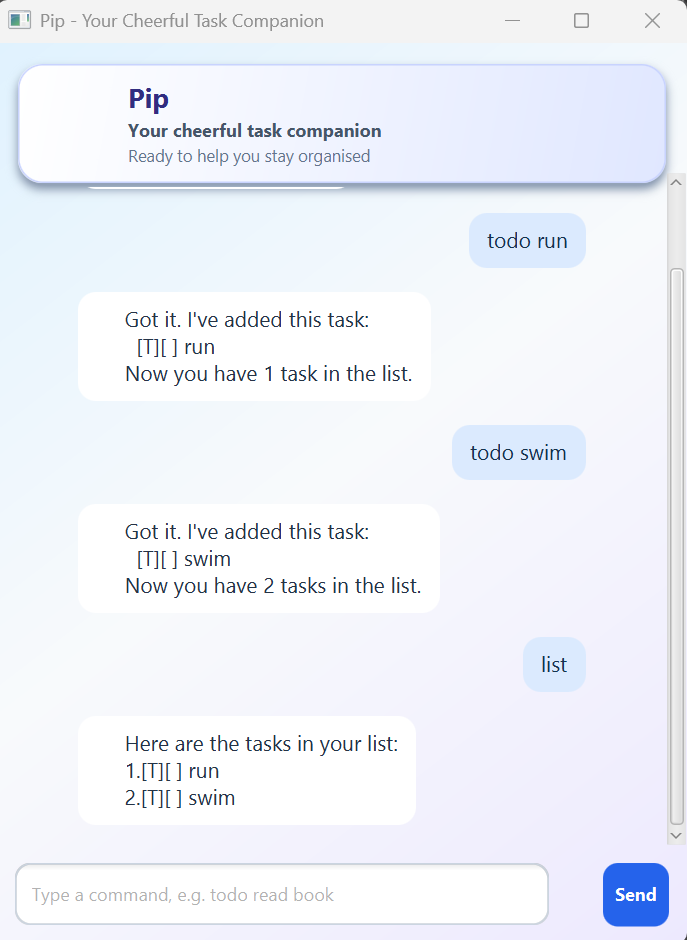

# Pip User Guide



Pip is a friendly desktop task manager. Type a command in the chat box, then
press **Send** or **Enter**. Tasks are saved automatically in `data/bot.txt`.

## Quick start

Type `list` to see your current tasks. Pip numbers tasks from 1; use those
numbers when marking or deleting tasks.

## Add tasks

### To-do

Adds a task without a date.

```text
todo buy groceries
```

### Deadline

Adds a task with a due date. Dates use `yyyy-MM-dd`; an optional time uses the
24-hour `yyyy-MM-dd HHmm` format.

```text
deadline submit report /by 2026-09-30
deadline call Alice /by 2026-09-30 1800
```

### Event

Adds an event with a start and end date/time. The end must be later than the
start.

```text
event project meeting /from 2026-09-20 1400 /to 2026-09-20 1600
```

Pip rejects duplicate tasks, missing descriptions, invalid dates, repeated
date markers, and events whose end is not after their start.

## Manage tasks

Replace `2` with the number of the task you want to change.

| Command | What it does | Example |
| --- | --- | --- |
| `list` | Shows all tasks | `list` |
| `mark N` | Marks task N as done | `mark 2` |
| `unmark N` | Marks task N as not done | `unmark 2` |
| `delete N` | Removes task N | `delete 2` |
| `sort` | Sorts dated tasks chronologically | `sort` |

## Search and dates

Find tasks whose descriptions contain a keyword:

```text
find report
```

Show deadlines and events occurring on a date:

```text
on 2026-09-30
```

Search is case-insensitive. The `on` command accepts a date only.

## Errors and helpful responses

If a command is incomplete, misspelled, or uses an invalid task number, Pip
shows an `OOPS!!!` message in a highlighted error style. Check the example in
the message and try again. Leading/trailing spaces and repeated spaces are
accepted and normalized.

If Pip cannot read a damaged task file, it reports the problem and keeps the
usable tasks. If it cannot save because of a file or permission problem, it
reports that too.

## Exit Pip

Type `bye` to close the application safely. The command is case-insensitive, so
`BYE` works as well.

## Command summary

```text
todo DESCRIPTION
deadline DESCRIPTION /by DATE[ TIME]
event DESCRIPTION /from DATE[ TIME] /to DATE[ TIME]
list
mark TASK_NUMBER
unmark TASK_NUMBER
delete TASK_NUMBER
find KEYWORD
on DATE
sort
bye
```
